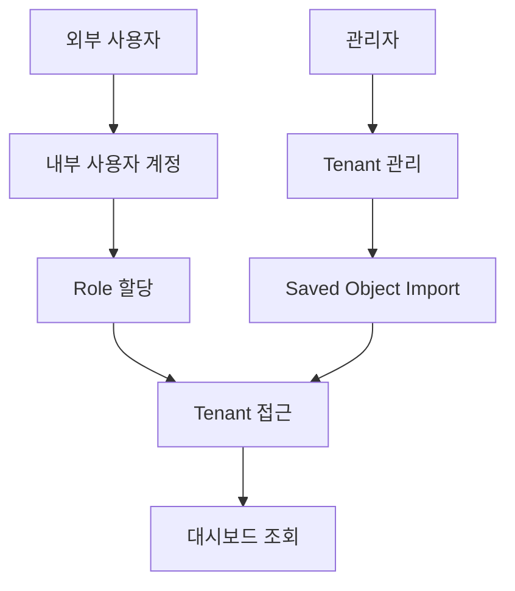
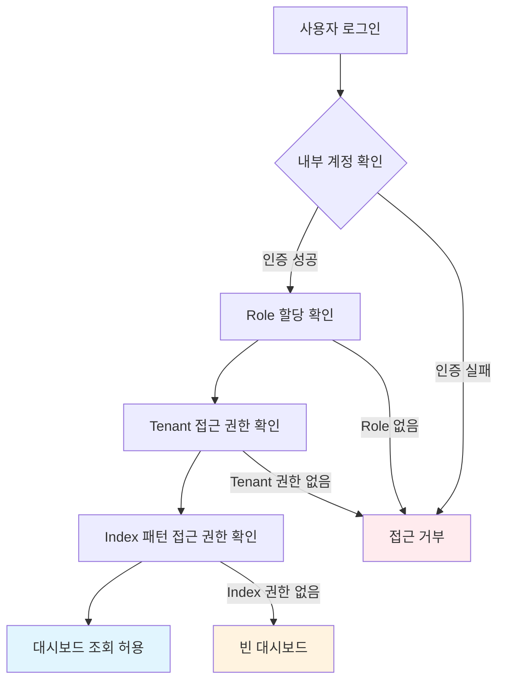

# OpenSearch 운영 가이드
{: .no_toc }

## 문서 정보
{: .no_toc .text-delta }

- **문서 버전**: 1.0  
- **최종 수정일**: 2025년 8월  
- **대상 독자**: 시스템 관리자, DevOps 엔지니어, 개발팀 팀원  
- **사전 요구사항**: OpenSearch 기본 개념 이해, 관리자 권한 보유

{: .note }
> <i class="fas fa-info-circle"></i> **참고**  
> 본 문서는 실제 운영 경험을 기반으로 포트폴리오용으로 재작성된 샘플 문서입니다.  
> 모든 이름, 계정, 경로, 날짜는 실제와 무관한 예시 데이터로 대체되었습니다.

---

<details open markdown="block">
  <summary>
    목차
  </summary>
  {: .text-delta }
1. TOC
{:toc}
</details>

---

## 요약

이 문서는 OpenSearch 운영 과정에서 자주 발생하는 문제들을 체계적으로 해결하기 위해 작성되었습니다.  
인덱스 관리, 시각화 유지보수, 대시보드 권한 설정 등 일상적인 운영 업무에서 겪는 어려움을 단계별로 해결할 수 있는 실용적인 가이드를 제공합니다.

### 주요 효과
- **운영 안정성 향상**: 표준화된 절차로 인한 오류 감소
- **생산성 개선**: 온보딩 시간 단축 및 문제 해결 시간 최소화  
- **권한 관리 최적화**: 보안을 유지하면서 효율적인 접근 제어

---

## 용어 사전


| 용어            | 정의                                                 |
| ------------- | -------------------------------------------------- |
| Saved Object  | OpenSearch Dashboards의 저장 객체 (대시보드, 시각화, 인덱스 패턴 등) |
| Tenant        | 대시보드와 설정을 격리하는 논리적 공간                              | 
| Role          | 사용자 권한의 집합                                         | 
| Index Pattern | 데이터 검색을 위한 인덱스 매칭 패턴                               |
| Visualization | 데이터 시각화 차트/그래프                                     |

---

## 1. 대시보드 공유 권한 설정


### 1.1 개요

대시보드 접근자는 개발자뿐 아니라 비개발자도 포함될 수 있으므로, 접근 제어는 최소 권한 원칙에 따라 설정합니다.

{: .note }
> 사용자는 자신의 업무 수행에 필요한 최소한의 권한만 가져야 합니다.  
> 대시보드 조회, 편집, 관리 등 역할(Role)에 따라 접근 범위를 제한해야 합니다.  
> 이를 통해 보안 사고와 운영 실수를 예방할 수 있습니다.

### 1.2 아키텍처 구성요소



### 1.3 설정 과정

#### 1단계: 사용자 계정 생성

```bash
# OpenSearch Security Plugin
POST _plugins/_security/api/internalusers/<sample_user>
{
  "password": "secure_password_here",
  "backend_roles": ["read_only"],
  "attributes": {
    "description": "Read-only dashboard access user"
  }
}
```
**매개변수 설명**
- `password`: 사용자 비밀번호로 평문으로 입력 시 자동으로 bcrypt로 암호화됩니다.
- `backend_roles`: 역할(Role) 매핑을 위한 그룹 식별자로 권한은 Role 설정에서 정의합니다.
- `attributes`: 추가 정보를 저장하는 사용자 메타 데이터로 접근 권한에는 영향을 주지 않습니다.

{: .note }
> <i class="fas fa-info-circle"></i> **참고**  
> 사용자 계정 생성만으로는 로그인만 가능합니다.   
> 실제 대시보드 접근을 위해서는 Role과 Role Mapping을 추가로 설정해야 합니다.


#### 2단계: Tenant 생성

1. **Security** → **Tenants** → **Create tenant**
2. **Tenant name**: `demo-users`
3. **Description**: `Shared dashboard space for external users`

{: .note }
> <i class="fas fa-info-circle"></i> **참고**  
> Tenant는 대시보드 리소스(Saved Objects)를 공유할 수 있는 공간입니다.  
> 여기서 생성한 Tenant를 Role 권한에 매핑해야 대시보드 접근이 가능합니다.

#### 3단계: Role 구성

```json
PUT _plugins/_security/api/roles/role-demo-dashboard-reader
{
  "cluster_permissions": [
    "opensearch_dashboards_all_read",
    "cluster_composite_ops_ro"
  ],
  "index_permissions": [
    {
      "index_patterns": [
        "demo-service-api-log*",
        "console-log-demo-*"
      ],
      "allowed_actions": [
        "read",
        "search",
        "view_index_metadata"
      ]
    }
  ],
  "tenant_permissions": [
    {
      "tenant_patterns": ["demo-users"],
      "allowed_actions": ["kibana_all_read"]
    }
  ]
}
```

**권한 세부 설명**

| 권한 유형       | 권한명                              | 목적                  |
| ----------- | -------------------------------- | ------------------- |
| **Cluster** | `opensearch_dashboards_all_read` | Dashboards 전체 읽기 권한 |
| **Cluster** | `cluster_composite_ops_ro`       | 검색/매핑 API 호출 허용     |
| **Index**   | `read`, `search`                 | 인덱스 데이터 조회 및 검색 권한        |
| **Index**   | `view_index_metadata`            | 필드 자동완성 지원          |
| **Tenant**  | `kibana_all_read`                | Tenant 내 Saved Object 읽기 권한  |


{: .note }
> <i class="fas fa-info-circle"></i> **참고**    
> 복잡한 권한 설정은 UI에서 제대로 표시되지 않을 수 있습니다.  
> 정확한 설정을 위해 Dev Tools에서 REST API를 사용하세요.


#### 4단계: 사용자-Role 매핑

1. Security → Roles → role-demo-dashboard-reader → Mapped users → Add user
2. 앞서 생성한 사용자(sample_user)를 선택해 매핑합니다.

매핑이 완료되면 sample_user 계정으로 로그인 시 지정된 인덱스, Tenant에 대한 읽기 전용 접근이 가능합니다.

### 1.4 권한 흐름 구조



{: .warning }
> <i class="fas fa-exclamation-circle"></i> **주의**  
> 권한 설정을 완료한 후에는 테스트 계정으로 로그인하여 각 단계가 의도한 대로 동작하는지 반드시 확인하세요. 

---

## 2. Saved Object 관리


### 2.1 객체 이동 워크플로우


### 2.2 단계별 가이드

#### 2.2.1 내보내기 과정

1. **관리자 계정으로 로그인** 후 Global tenant 전환
2. **Management** → **Saved Objects** 이동
3. 대상 객체 선택 (Dashboard, Visualization, Index Pattern)
4. **Export** → **[필수]** Include related objects 체크
5. `.ndjson` 파일 다운로드

{: .note }
> <i class="fas fa-info-circle"></i> **참고**  
> Related Objects 미포함 시 시각화와 인덱스 패턴 연결이 깨져서 가져오기 시 오류가 발생할 수 있습니다.

#### 2.2.2 가져오기 과정

1. 대상 **tenant** (예: `demo-users`)로 전환
2. **Management** → **Saved Objects** → **Import**
3. `.ndjson` 파일 업로드
4. Overwrite 옵션 체크 해제 (기존 객체 보호)
5. 대시보드 import 진행
   
   {: .warning }
   > <i class="fas fa-exclamation-circle"></i> **주의**  
   > 기존 객체를 덮어쓰지 않으려면 **Overwrite** 옵션을 반드시 체크 해제하세요.

5. 대시보드 정상 동작 여부 검증

### 2.3 중요 요구사항


{: .important }
> <i class="fas fa-exclamation-triangle"></i> **중요**  
> 다음 요구사항을 준수하지 않으면 시각화가 깨지거나 데이터 손실이 발생할 수 있습니다.

| 구분       | 요구사항               | 미준수 시 위험      |
| -------- | ------------------ | ------------- |
| **[필수]** | 관리자 계정으로 Import 수행 | 일부 객체 로딩 실패   |
| **[필수]** | Related Objects 포함 | 시각화 연결 오류     |
| **[권장]** | Summary Object 제거 | Import 실패 가능성 |

---

## 3. 인덱스 패턴 UUID 문제 복구 가이드


### 3.1 문제 증상

```
Error: "The index pattern associated with this object no longer exists"
```

**원인**: 시각화가 인덱스 패턴을 이름이 아닌 UUID로 참조하므로 동일 이름으로 재생성해도 기존 시각화에서 참조 ID가 맞지 않음

### 3.2 해결 방법

#### 방법 1: 수동 복구 (권장)

1. **인덱스 패턴 재생성**
   - **Management** → **Index Patterns** → 기존 패턴 삭제
   - **동일한 이름**으로 새 패턴 생성

2. **새 Pattern ID 확인**
   ```
   URL: .../indexPatterns/patterns/[NEW-UUID-HERE]
   ```

3. **시각화 JSON 내 references 수정**
   - **Management** → **Saved Objects** → 대상 Visualization 선택
   - **Inspect** (돋보기 아이콘) 클릭
   - `references` 섹션에서 `id` 값을 새 UUID로 변경

#### 방법 2: 대량 수정 (다중 시각화)

1. 모든 시각화/대시보드 내보내기 (`export.ndjson`)
2. `sed`로 ID 일괄 치환
    ```bash
    OLD_ID="old-uuid"
    NEW_ID="new-uuid"
    
    # macOS (BSD sed)
    sed -i '' "s/$OLD_ID/$NEW_ID/g" exported_objects.ndjson

    # Linux (GNU sed)
    sed -i "s/$OLD_ID/$NEW_ID/g" exported_objects.ndjson
    ```
3. 수정된 파일 다시 import


{: .important }
> <i class="fas fa-exclamation-triangle"></i> **중요**  
> 대시보드, 시각화, 인덱스 패턴은 서로 연결되어 있습니다.  
> ID를 수정할 때는 모든 관련 객체의 ID를 일관성 있게 업데이트해야 합니다.  
> 수정 후에는 export.ndjson 파일을 열어서 `"id": "..."` 값들이 올바르게 변경되었는지 반드시 확인하세요.

---

## 4. 문제 해결

{: .highlight }
> **대상 독자**: 모든 사용자  
> **난이도**: 초급~중급 (오류 대응 및 검증)

### 4.1 일반적인 문제

| 문제 및 증상                                  | 원인                                                                                                          | 해결 방법                                                                           |
| ---------------------------------------- | ----------------------------------------------------------------------------------------------------------- | ------------------------------------------------------------------------------- |
| **403 Forbidden**<br>시각화 로딩 실패           | 대시보드가 검색/집계 API(`/_search`, `/_field_caps`, `/_mapping`) 호출 시 `cluster_composite_ops_ro` 권한이 없으면 차단됨 | Role에 `cluster_composite_ops_ro` 권한 추가<br>※ 단순 인덱스 `read` 권한만으로는 부족             |
| **인덱스 패턴 오류**<br>빈 대시보드 표시               | 시각화가 인덱스 패턴 UUID를 참조하는데 재생성 시 ID가 달라져 불일치 발생                                                               | Role의 `index_patterns` 값 검증 및 시각화 참조 ID 업데이트<br>※ `ndjson` 내보내기 후 ID 일관성 확인 필요  |
| **Import 실패**<br>*Missing references* 오류 | Export 시 관련 객체(Visualization, Index Pattern 등) 미포함 시 발생                                               | Export 시 `Include related objects` 옵션 체크 후 다시 Import<br>※ Summary object는 제거 권장 |
| **로그인 문제**<br>권한 적용 안됨                   | Security 플러그인의 권한 캐시가 즉시 반영되지 않음                                                                            | 로그아웃 후 다시 로그인<br>※ Dev Tools에서 Role Mapping 적용 여부 확인 필요                         |

---

## 5. 모범 사례
 
{: .highlight }
> **대상 독자**: 관리자, 시스템 운영자  
> **난이도**: 중급 (전략적 운영 및 보안 가이드라인)

### 5.1 보안 가이드라인

- **최소 권한 원칙**: 업무에 반드시 필요한 인덱스에만 사용자에게 접근 권한을 부여하세요.
- **인증 기반 접근**: 익명 접근을 차단하고 반드시 로그인을 통해서만 접근할 수 있도록 설정하세요.
- **정기 권한 검토**: 분기마다 사용자 권한을 점검하여 불필요한 접근 권한을 제거하세요.

### 5.2 운영 우수성

- **변경 이력 관리**: 모든 설정 변경 사항은 문서화하여 팀 내에 공유하세요.
- **정기 백업**: Export한 .ndjson 파일을 버전별로 관리하여 복구할 수 있도록 준비하세요.
- **사전 테스트**: 운영 환경에 적용하기 전 개발 환경에서 반드시 검증하세요.

### 5.3 링크 공유 전략

**권장 방법**: Saved Object 링크 사용 (실시간 데이터 반영)
```
https://<your-opensearch-host>/app/dashboards#/view/<dashboard-id>?security_tenant=demo-users
```

**링크 생성 방법**: **Dashboard** → **Share** → **Permalink** → **Saved object** → **Copy link**

---

{: .note }
> <i class="fas fa-external-link-alt"></i> **참고 자료**  
> 이 가이드와 관련된 추가 정보는 [Quick Reference](./quick-reference) 페이지를 참조하세요.
