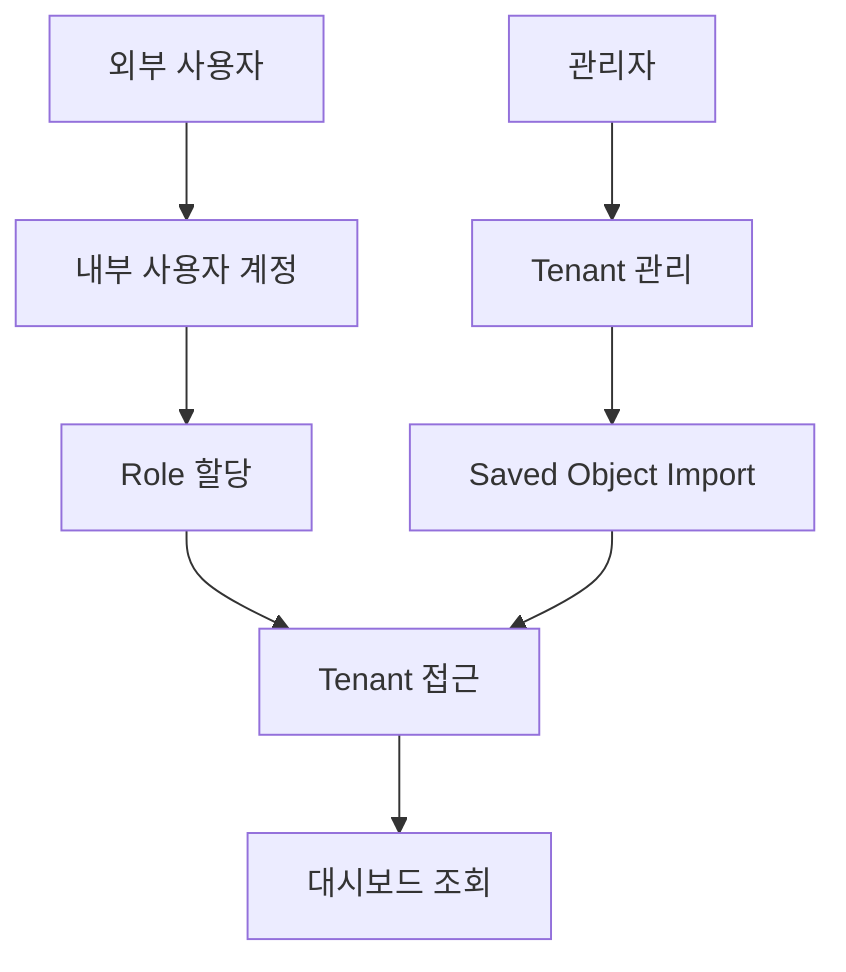
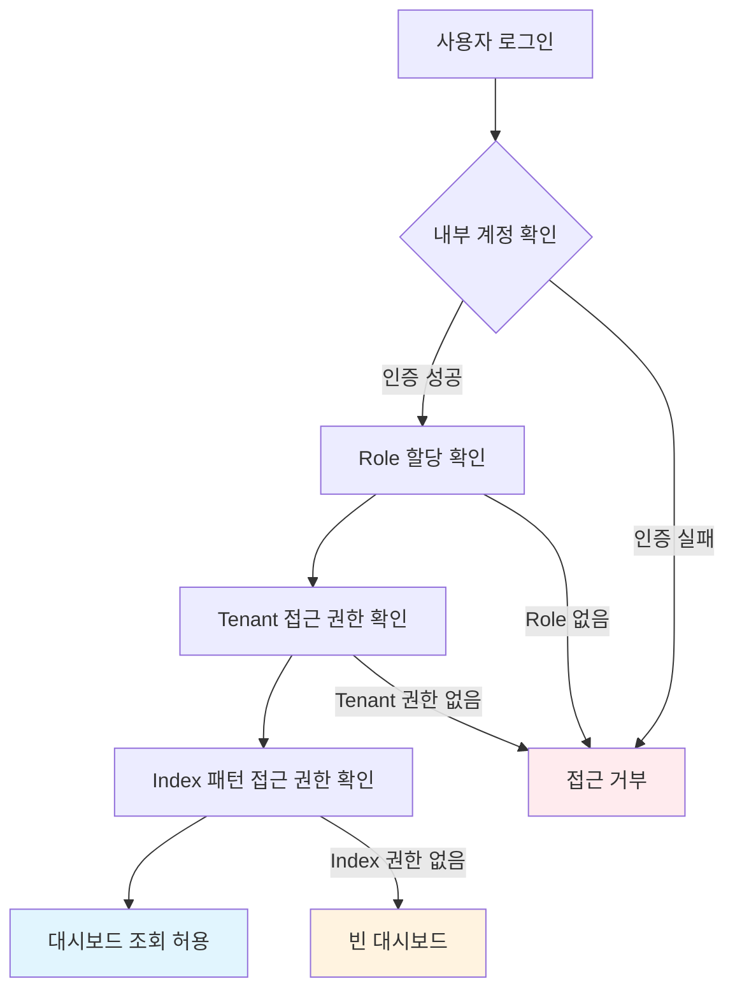
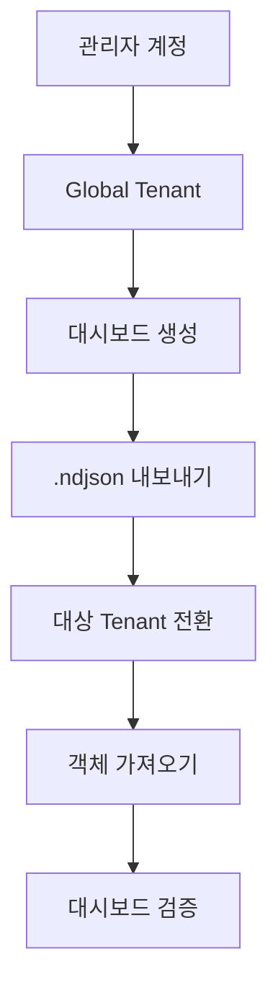

# OpenSearch 운영 가이드
{: .no_toc }

## 문서 정보
{: .no_toc .text-delta }

- **문서 버전**: 1.0  
- **최종 수정일**: 2025년 8월  
- **대상 독자**: 시스템 관리자, DevOps 엔지니어, 개발팀 팀원  
- **사전 요구사항**: OpenSearch 기본 개념 이해, 관리자 권한 보유

{: .warning }
**중요 안내**  
본 문서는 실제 운영 경험을 기반으로 포트폴리오용으로 재작성된 샘플 문서입니다.  
모든 이름, 계정, 경로, 날짜는 실제와 무관한 예시 데이터로 대체되었습니다.

<details open markdown="block">
  <summary>
    목차
  </summary>
  {: .text-delta }
1. TOC
{:toc}
</details>

---

## 요약

본 문서는 사내 로그 분석 환경으로 도입된 OpenSearch의 운영 안정성 확보를 위해 작성되었습니다. 
인덱스 관리, 시각화 유지보수, 대시보드 공유 권한 설정 과정에서 발생하는 반복적인 문제들을 해결하기 위한 표준화된 가이드를 제공합니다.

### 주요 효과
- **운영 안정성 향상**: 표준화된 절차로 인한 오류 감소
- **생산성 개선**: 온보딩 시간 단축 및 문제 해결 시간 최소화  
- **권한 관리 최적화**: 보안을 유지하면서 효율적인 접근 제어

---

## 용어 사전

| 용어            | 정의                                                 | 비고       |
| ------------- | -------------------------------------------------- | -------- |
| Saved Object  | OpenSearch Dashboards의 저장 객체 (대시보드, 시각화, 인덱스 패턴 등) | '저장된 객체' |
| Tenant        | 대시보드와 설정을 격리하는 논리적 공간                              | '테넌트'    |
| Role          | 사용자 권한의 집합                                         | '역할'     |
| Index Pattern | 데이터 검색을 위한 인덱스 매칭 패턴                               | '인덱스 패턴' |
| Visualization | 데이터 시각화 차트/그래프                                     | '시각화'    |

---

## 1. 문제 정의 및 해결 성과

{: .highlight }
> **대상 독자**: 관리자, 프로젝트 매니저  
> **난이도**: 초급 (개념 이해)

### 1.1 주요 문제점

| 문제 영역      | 세부 현상                          | 업무 영향                      |
| ---------- | ------------------------------ | -------------------------- |
| **인덱스 관리** | 인덱스 패턴 재생성 시 UUID 불일치          | 기존 시각화 연결 끊김 → 대시보드 서비스 중단 |
| **권한 관리**  | Tenant 간 Saved Object 이동 절차 부재 | 팀 간 협업 지연 및 중복 작업 발생       |
| **접근 제어**  | 비개발자 대상 대시보드 공유 권한 설정 복잡성      | 잘못된 권한 설정으로 보안 위험 증가       |

### 1.2 해결 성과

-  대시보드 구축 담당자 온보딩 시간 **50% 단축**
- 권한 설정 오류 **0건 (3개월 기준)**
- 인덱스 변경 시 복구 시간 **80% 단축 (2시간 → 24분)**  

---

## 2. 대시보드 공유 권한 설정

{: .highlight }
> **대상 독자**: 시스템 관리자, DevOps 엔지니어  
> **난이도**: 중급 (권한 설정 경험 필요)

### 2.1 개요

비개발자가 특정 대시보드에 안전하게 접근할 수 있도록 최소 권한 원칙 기반의 접근 제어 절차를 정의합니다.

### 2.2 아키텍처 구성요소



### 2.3 설정 과정

#### 1단계: 사용자 계정 생성

```bash
# OpenSearch Security Plugin
POST _plugins/_security/api/internalusers/sample_user
{
  "password": "secure_password_here",
  "backend_roles": ["read_only"],
  "attributes": {
    "description": "Read-only dashboard access user"
  }
}
```

- `password`: 평문 입력 시 자동 bcrypt 해싱
- `backend_roles`: Role Mapping에 사용됨
- `attributes`: 메타데이터용 (권한에 영향 없음)

→ 실제 접근 권한을 위해서는 반드시 Role 및 Role Mapping 정의 필요

#### 2단계: Tenant 생성

1. **Security** → **Tenants** → **Create tenant**
2. **Tenant name**: `demo-users`
3. **Description**: `Shared dashboard space for external users`

#### 3단계: Role 구성

{: .warning }
**주의사항**: UI에서 일부 권한이 표시되지 않으므로 Dev Tools를 통한 REST API 실행 필수

```json
PUT _plugins/_security/api/roles/role-demo-dashboard-reader
{
  "cluster_permissions": [
    "opensearch_dashboards_all_read",
    "cluster_composite_ops_ro"
  ],
  "index_permissions": [
    {
      "index_patterns": [
        "demo-service-api-log*",
        "console-log-demo-*"
      ],
      "allowed_actions": [
        "read",
        "search",
        "view_index_metadata"
      ]
    }
  ],
  "tenant_permissions": [
    {
      "tenant_patterns": ["demo-users"],
      "allowed_actions": ["kibana_all_read"]
    }
  ]
}
```

**권한 세부 설명**

| 권한 유형       | 권한명                              | 목적                  |
| ----------- | -------------------------------- | ------------------- |
| **Cluster** | `opensearch_dashboards_all_read` | Dashboards 전체 읽기 접근 |
| **Cluster** | `cluster_composite_ops_ro`       | 검색/매핑 API 호출 허용     |
| **Index**   | `read`, `search`                 | 데이터 조회 및 검색         |
| **Index**   | `view_index_metadata`            | 필드 자동완성 지원          |
| **Tenant**  | `kibana_all_read`                | Saved Object 읽기 권한  |

#### 4단계: 사용자-Role 매핑

- **Security** → **Roles** → **role-demo-dashboard-reader** → **Mapped users** → **Add user**

### 2.4 권한 흐름 구조



{: .note }
**[권장사항]**  
테스트 계정으로 각 단계별 권한이 정상 적용되는지 반드시 확인 필요 

---

## 3. Saved Object 관리

{: .highlight }
> **대상 독자**: DevOps 엔지니어, 시각화 담당자  
> **난이도**: 중급 (객체 관리 경험 필요)

### 3.1 객체 이동 워크플로우



### 3.2 단계별 가이드

#### 3.2.1 내보내기 과정

1. **관리자 계정으로 로그인** 후 Global tenant 전환
2. **Management** → **Saved Objects** 이동
3. 대상 객체 선택 (Dashboard, Visualization, Index Pattern)
4. **Export** → **[필수]** Include related objects 체크
5. `.ndjson` 파일 다운로드

#### 3.2.2 가져오기 과정

1. **Target tenant** (예: `demo-users`)로 전환
2. **Management** → **Saved Objects** → **Import**
3. `.ndjson` 파일 업로드
4. {: .warning } **주의사항**: Overwrite 체크 해제 (기존 객체 보호)
5. 대시보드 정상 동작 여부 검증

### 3.3 중요 요구사항

{: .important }
**[중요]** 아래 요구사항을 준수하지 않을 경우 시스템 오류나 데이터 손실이 발생할 수 있습니다.

| 구분       | 요구사항               | 미준수 시 위험      |
| -------- | ------------------ | ------------- |
| **[필수]** | 관리자 계정으로 Import 수행 | 불완전한 객체 로딩    |
| **[필수]** | Related Objects 포함 | 시각화 연결 오류     |
| **[권장]** | Summary Object 제거 | Import 실패 가능성 |

---

## 4. 인덱스 패턴 복구 가이드

{: .highlight }
> **대상 독자**: 시스템 관리자, 개발자  
> **난이도**: 고급 (JSON 수정 및 기술적 문제 해결)

### 4.1 문제 식별

**증상**: 인덱스 패턴 재생성 후 시각화 오류 발생
```
Error: "The index pattern associated with this object no longer exists"
```

**원인**: 시각화가 인덱스 패턴을 UUID로 참조하므로 재생성 시 ID 불일치

### 4.2 해결 방법: ID 매핑 업데이트

#### 방법 1: 권장 해결방법

1. **인덱스 패턴 재생성**
   - **Management** → **Index Patterns** → 기존 패턴 삭제
   - **동일한 이름**으로 새 패턴 생성

2. **새 Pattern ID 확인**
   ```
   URL: .../indexPatterns/patterns/[NEW-UUID-HERE]
   ```

3. **시각화 JSON 수정**
   - **Management** → **Saved Objects** → 대상 Visualization 선택
   - **Inspect** (돋보기 아이콘) 클릭
   - `references` 섹션에서 `id` 값을 새 UUID로 교체

#### 방법 2: 대량 수정 (다중 시각화)

```bash
# 1. 시각화 / 대시보드 등 export
# (관리 → 저장된 객체 → 내보내기)

# 2. ID 치환
OLD_ID="old-uuid-here"
NEW_ID="new-uuid-here"

# macOS (BSD sed)
sed -i '' "s/$OLD_ID/$NEW_ID/g" exported_objects.ndjson

# Linux (GNU sed)
sed -i "s/$OLD_ID/$NEW_ID/g" exported_objects.ndjson

# 3. 수정된 파일 import
```

{: .warning }
**주의사항**
- 대시보드 → 시각화, 시각화 → 인덱스 패턴 등 참조가 서로 연결돼 있어 단순 치환 시 관련 객체의 ID도 모두 맞춰줘야 정상 동작
- export.ndjson 파일을 열어서 `"id": "..."` 부분이 일관성 있게 수정됐는지 확인 필요

---

## 5. 문제 해결

{: .highlight }
> **대상 독자**: 모든 사용자  
> **난이도**: 초급~중급 (오류 대응 및 검증)

### 5.1 일반적인 문제

| 문제 및 증상                                  | 원인                                                                                                          | 해결 방법                                                                           |
| ---------------------------------------- | ----------------------------------------------------------------------------------------------------------- | ------------------------------------------------------------------------------- |
| **403 Forbidden**<br>시각화 로딩 실패           | Dashboard가 검색/집계 API(`/_search`, `/_field_caps`, `/_mapping`)를 호출할 때 `cluster_composite_ops_ro` 권한이 없으면 차단됨 | Role에 `cluster_composite_ops_ro` 권한 추가<br>※ 단순 인덱스 `read` 권한만으로는 부족             |
| **인덱스 패턴 오류**<br>빈 대시보드 표시               | 시각화가 인덱스 패턴 UUID를 참조하는데, 재생성 시 ID가 달라져 불일치 발생                                                               | Role의 `index_patterns` 값 검증 및 시각화 참조 ID 업데이트<br>※ `ndjson` 내보내기 후 ID 일관성 확인 필요  |
| **Import 실패**<br>*Missing references* 오류 | Export 시 관련 객체(Visualization, Index Pattern 등)를 포함하지 않았을 때 발생                                               | Export 시 `Include related objects` 옵션 체크 후 다시 Import<br>※ Summary object는 제거 권장 |
| **로그인 문제**<br>권한 적용 안됨                   | Security 플러그인의 권한 캐시가 즉시 반영되지 않음                                                                            | 로그아웃 후 다시 로그인<br>※ Dev Tools에서 Role Mapping 적용 여부 확인 필요                         |

---

## 6. 모범 사례

{: .highlight }
> **대상 독자**: 관리자, 시스템 운영자  
> **난이도**: 중급 (전략적 운영 및 보안 가이드라인)

### 6.1 보안 가이드라인

- **[필수]** **최소 권한 원칙 적용**: 반드시 필요한 인덱스만 접근 허용
- **[금지]** **익명 접근**: 반드시 로그인 기반 접근만 허용
- **[권장]** **정기 권한 검토**: 분기별 사용자 권한 Audit 수행

### 6.2 운영 우수성

- **문서화**: 모든 설정 변경 이력을 기록 및 공유
- **백업**: Export된 .ndjson 파일 버전 관리
- **테스트**: 운영 환경 적용 전 반드시 개발 환경에서 검증

### 6.3 링크 공유 전략

**권장**: Saved Object 링크 사용 (실시간 데이터 반영)
```
https://<your-opensearch-host>/app/dashboards#/view/<dashboard-id>?security_tenant=demo-users
```

**생성 절차**: Dashboard → Share → Permalink → Saved object → Copy link

---

{: .note }
이 가이드와 관련된 추가 정보는 [Quick Reference](./quick-reference) 페이지를 참조하십시오.