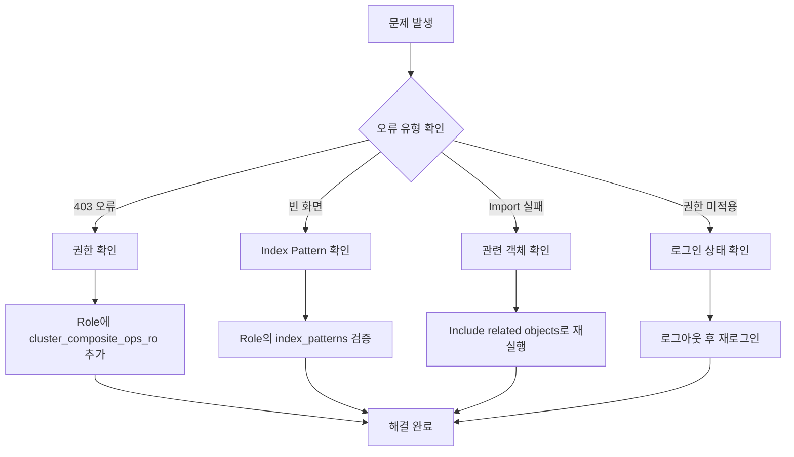

# Quick Reference
{: .no_toc }

즉시 사용 가능한 핵심 명령어와 일반적인 문제 해결 방법을 요약 정리
{: .fs-6 .fw-300 }

<details open markdown="block">
  <summary>
    목차
  </summary>
  {: .text-delta }
1. TOC
{:toc}
</details>

---

## A. 핵심 명령어

### REST API 명령어

| 작업 | REST API 명령어 | 실행 위치 |
|------|----------------|----------|
| **사용자 생성** | `POST _plugins/_security/api/internalusers/[user_id]` | Dev Tools |
| **Role 생성** | `PUT _plugins/_security/api/roles/[role_name]` | Dev Tools |
| **Tenant 생성** | UI에서 Security → Tenants → Create | Dashboards UI |
| **객체 Export** | Management → Saved Objects → Export | Dashboards UI |
| **객체 Import** | Management → Saved Objects → Import | Dashboards UI |

### 권한 설정 템플릿

```json
{
  "cluster_permissions": [
    "opensearch_dashboards_all_read",
    "cluster_composite_ops_ro"
  ],
  "index_permissions": [{
    "index_patterns": ["your-index-pattern*"],
    "allowed_actions": ["read", "search", "view_index_metadata"]
  }],
  "tenant_permissions": [{
    "tenant_patterns": ["your-tenant"],
    "allowed_actions": ["kibana_all_read"]
  }]
}
```

---

## B. 문제 해결 요약

### 즉시 진단 가이드

| 문제 증상         | 즉시 확인사항                       | 해결책               |
| ------------- | ----------------------------- | ----------------- |
| **403 오류**    | `cluster_composite_ops_ro` 권한 | Role에 권한 추가       |
| **빈 대시보드**    | `index_patterns` 설정           | Role의 Index 패턴 검증 |
| **Import 실패** | Related objects 포함 여부         | 의존성 객체 먼저 Import  |
| **권한 미적용**    | 로그인 상태                        | 로그아웃 후 재로그인       |

### 문제 해결 플로우



---

## C. 필수 검증 체크리스트

### 권한 설정 후 확인사항

- [ ] **사용자 계정**: Internal User 생성 완료
- [ ] **Role 정의**: 필요한 권한 모두 포함
- [ ] **Role 매핑**: 사용자에게 Role 할당 완료
- [ ] **Tenant 접근**: 대상 Tenant 접근 가능
- [ ] **Index 패턴**: 시각화에서 데이터 정상 표시
- [ ] **대시보드**: 모든 시각화 정상 로딩
- [ ] **링크 공유**: 외부 접근 시 정상 동작

### 문제 발생 시 진단 순서

1. **로그인 확인**: 올바른 계정으로 로그인되었는지
2. **Tenant 확인**: 올바른 Tenant에서 작업하고 있는지  
3. **권한 확인**: Role에 필요한 권한이 모두 있는지
4. **매핑 확인**: 사용자-Role 매핑이 올바른지
5. **캐시 확인**: 로그아웃 후 재로그인으로 권한 갱신

---

## D. 운영 시 주의사항

### 보안 관련

| 주의사항 | 권장 대응 | 추가 팁 |
|---------|-----------|---------|
| UI 권한 설정 한계 | Dev Tools REST API 사용 | JSON 형식 미리 준비 |
| Overwrite 시 객체 손실 | 백업 후 Import | .ndjson 파일 버전 관리 |
| 익명 접근 보안 위험 | 반드시 로그인 기반 접근 | 정기적 권한 audit 수행 |

### 성능 최적화

{: .note }
> <i class="fas fa-lightbulb"></i> **Tip**  
> 많은 수의 인덱스를 다룰 때는 와일드카드 패턴을 구체적으로 명시하여 불필요한 권한 확산을 방지하세요.

```bash
# 좋은 예: 구체적인 패턴
"index_patterns": ["app-logs-2024-*", "api-logs-production-*"]

# 나쁜 예: 너무 광범위한 패턴  
"index_patterns": ["*"]
```

---

## E. 명령어 실행 예시

### 1. 새 사용자 생성

```bash
POST _plugins/_security/api/internalusers/dashboard_viewer
{
  "password": "SecurePass123!",
  "backend_roles": ["dashboard_readers"],
  "attributes": {
    "department": "analytics",
    "description": "Dashboard view-only access"
  }
}
```

### 2. 읽기 전용 Role 생성

```bash
PUT _plugins/_security/api/roles/readonly_dashboard_role
{
  "cluster_permissions": [
    "opensearch_dashboards_all_read",
    "cluster_composite_ops_ro"
  ],
  "index_permissions": [
    {
      "index_patterns": ["logs-*", "metrics-*"],
      "allowed_actions": [
        "read", 
        "search", 
        "view_index_metadata"
      ]
    }
  ],
  "tenant_permissions": [
    {
      "tenant_patterns": ["shared_dashboards"],
      "allowed_actions": ["kibana_all_read"]
    }
  ]
}
```

### 3. Role 매핑

```bash
PUT _plugins/_security/api/rolesmapping/readonly_dashboard_role
{
  "backend_roles": ["dashboard_readers"],
  "description": "Mapping for dashboard read-only users"
}
```

---

## F. 관련 문서 및 지원

### 추가 자료

- [OpenSearch Security Access control Guide](https://docs.opensearch.org/latest/security/access-control/users-roles/)
- [Dashboards User Guide](https://docs.opensearch.org/latest/dashboards)
- [Index Templates Documentation](https://docs.opensearch.org/latest/im-plugin/index-templates)

### 기술 지원

| 지원 유형 | 연락처 | 대응 시간 |
|----------|--------|-----------|
| **긴급 장애** | IT 헬프데스크 | 즉시 |
| **일반 문의** | 개발팀 채널 | 24시간 내 |
| **문서 개선** | GitHub Issues | 주 단위 |

---

{: .important }
> <i class="fas fa-sync-alt"></i> **안내**  
> 이 Quick Reference는 정기적으로 업데이트됩니다. 새로운 기능이나 변경사항이 있을 때마다 해당 내용을 반영하여 최신 상태를 유지합니다.

<div style="text-align: center; margin: 2rem 0;">
  <a href="/docs/guide" class="btn btn-outline">← 상세 가이드로 돌아가기</a>
  <a href="/" class="btn btn-primary">홈으로 가기</a>
</div>